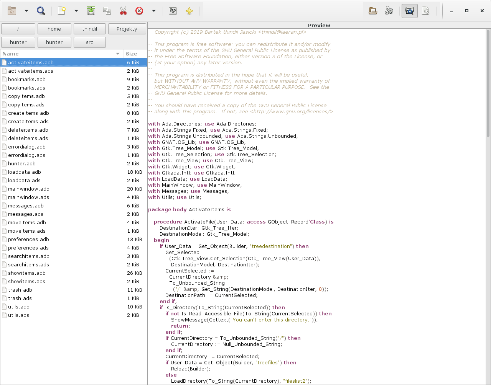
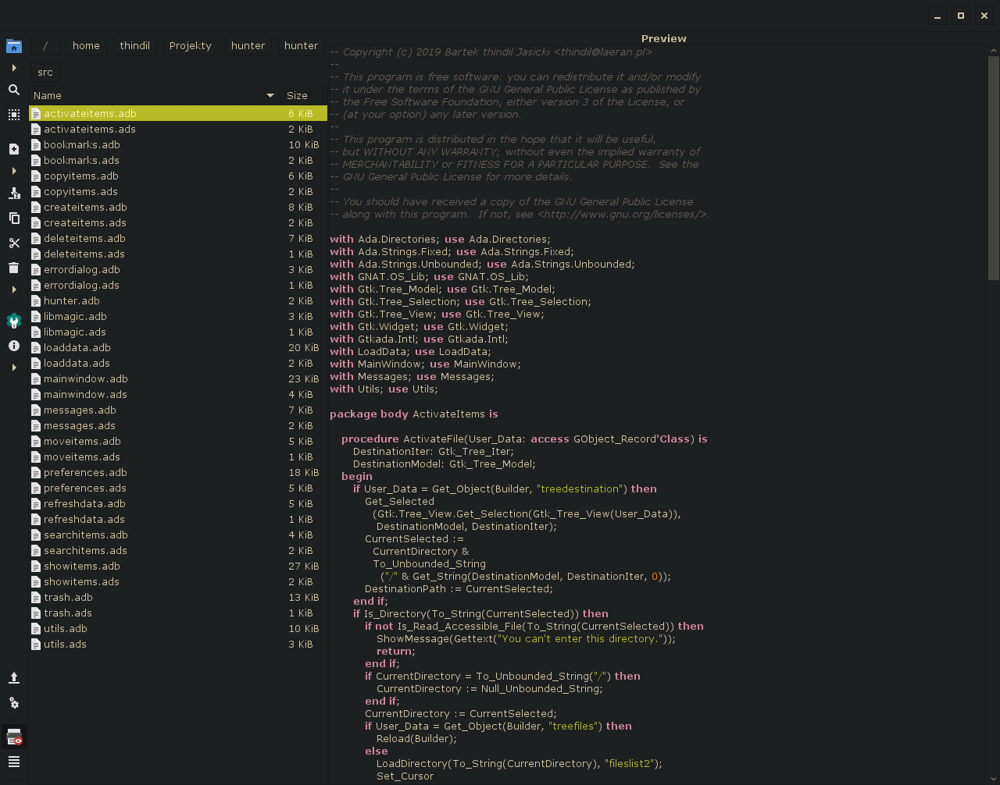

-- All lines which starts with double minus sign are comments and ignored by program. Unless they have colon sign. Then they are tags definition.
-- Ada Web Server template which will be used as HTML template for this file. Required for each file
-- layout: default
-- You may add as many tags as you want and they can be in any place in file, not only at beginning. Tags can be 4 types: strings, boolean, numeric or composite.
-- First 3 types of tags are in Name: Value scheme. For strings it can be any alphanumeric value without new line sign. For boolean it must be "true" or "false", for numeric any number. Program will detect self which type of tag is and properly set it. It always fall back to string value.
-- Composite tags first must be initialized with Name: [] then just add as many as you want values to it by Name: Value scheme.
-- For more informations about tags please check program documentation.
-- If you have enabled creation of sitemap in the project config file, you can set some sitemap parameters too. They are defined in this same way like tags, with ParameterName: Value.
-- priority - The priority of this URL relative to other URLs on your site, value between 0.0 and 1.0.
-- changefreq - How frequently the page is likely to change, value can be always, hourly, daily, weekly, monthly, yearly or never.
-- For more informations how this options works, please look at the program documentation.
-- Additionally, you can exclude this file from adding to sitemap by setting option insitemap: false.
-- If you have enabled creating Atom feed for the site, you must specify "title" tag for this page. If you will use this file as a main source of Atom feed, then you must add "title" tag for each section which will be used as source for Atom feed entry. If you want to set author name for Atom feed, you must add "author" tag. If you want to set author email for Atom feed, you must add "authoremail" tag. If you want to add short entry summary, you must add tag "summary". Did that tags will be for whole page or for each entry depends on your Atom feed configuration.
-- title: Graphical Linux File Manager
-- You can without problem delete all this comments from this file.
Hunter is a graphical file manager for Linux, inspired by [Ranger](https://ranger.github.io/).
At this moment, Hunter is under development but have most of features of file
managers. To open files, the program uses default applications from
[XDG MIME Application Specification](https://specifications.freedesktop.org/mime-apps-spec/mime-apps-spec-latest.html).
The program is available only for Linux 64-bit.

## Features

- Two column or one column mode: One column always show files and directories,
  second column is used to preview files and directories or select destination
  location for move or copy files. In one column mode, second column appear
  only when copying or moving files or directories.
- Everything in one window.
- Preview of text files (with syntax highlighting) and images.
- Standard file manager features: copy, delete, move files and directories,
  change their permissions, change application associated with them.
- Written in GTK and Ada. Should nicely integrate with selected desktop theme.
- Available in English and Polish languages.

## Screenshot

 

## Links

- Last release: [1.1](https://github.com/thindil/hunter/releases/tag/1.1)
  (2019-10-28)
- [GitHub](https://github.com/thindil/hunter)
- [Code documentation](docs/code/index.html)

## Donate

If you want to support the program development, you can donate some money by
Liberapay or Patreon.

 
